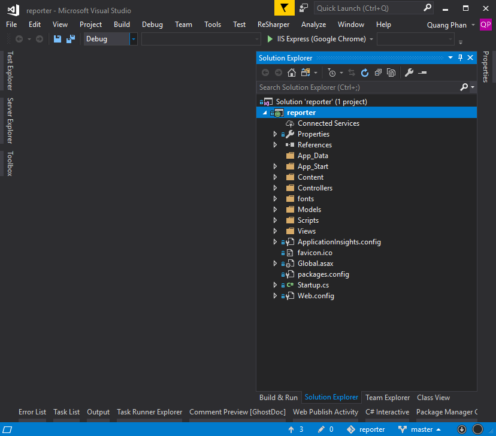
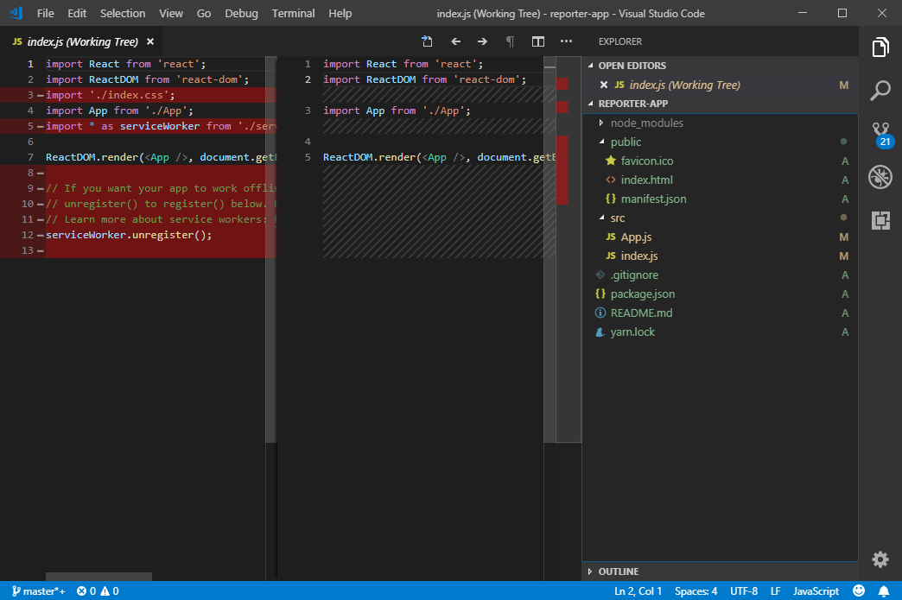
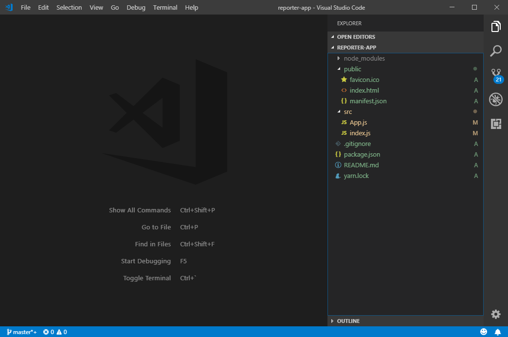

Day 1: create project

1. ASP.NET MVC5 solution

Here I create an asp.net mvc5 project and remain untouch until I start working with backend

2. React app

I'm using [create-react-app](https://github.com/facebook/create-react-app) to create my app at root dir of mvc solution.

After that, I deleted some unused files for simplify purpose:

the app structure likes below:

