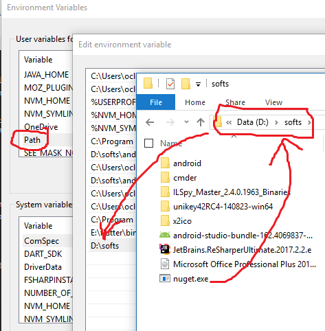

với .NET developers, packages không phải là 1 khái niệm xa lạ. Nó là các thư viện do chính MS cung cấp, hoặc do những developer khác viết ra dựa trên các nhu cầu cơ bản khi làm việc, sau đó publish lên để chia sẻ và nhận đóng góp của mọi người.

Hơn nữa, bằng [nuget](https://www.nuget.org/) bạn hoàn toàn có thể chia sẻ packages của mình cho mọi developers trên toàn thế giới. Trong bài viết này mình sẽ giới thiệu cách tạo và publish 1 package lên [nuget](https://www.nuget.org/).

### 1. nuget api key

Trước hết bạn cần có 1 tài khoản nuget. Nếu bạn đã có tài khoản Microsoft thì mọi việc càng đơn giản.

Sau khi có tài khoản, bạn đăng nhập và mở [api key](https://www.nuget.org/account/apikeys). Tại đây hãy tạo 1 api key sau đó lưu giữ cẩn thận, nuget chỉ cho phép bạn copy api key 1 lần duy nhất.

### 2. setup nuget tool

Tải nuget client version mới nhất tại [đây](https://www.nuget.org/downloads)

Để thuận tiện, bạn sửa `PATH` environment variable dẫn tới nơi chứa file vừa tải xong

Vậy là bạn đã xong phần setup.

### 3. Tạo package

Package là 1 "*Class Library*", do đó hãy chắc rằng code của bạn không có vấn đề gì sau khi build nhé.

Nuget package chứa 1 tập hợp các metadata như id, version, description...